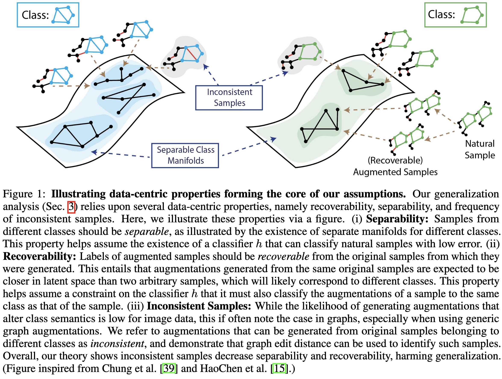

# ["Analyzing Data-Centric Properties for Contrastive Learning on Graphs"](https://arxiv.org/abs/2208.02810)



## Requirements
This code uses: 
```
- python 3.8
- torch 1.11.0
- torch-geometric 2.0.4
- PyGCL 0.1.2
```
For install a complete list of dependecies, use `pip install -r requirements.txt`.

## Quick Start 
```
mkdir data
mkdir logs
cd datagen
./create_dataset.sh #create a synthetic dataset to evaluate on.
cd ../examples 
./run_method.sh #train a graph SSL method the generated dataset.
./run_svc.ch #evaluate over different style ratios.
./run_compute_invariance_sep.sh #compute the separability vs. invariance scores.
```

## Synthetic Dataset Generation
We provide an example script for generating a synthetic dataset in `datagen/create_dataset.sh`. With default settings, dataset files will be saved in, `./data/`. Augmentations designed for this synthetic dataset are provided in:

- `edge_removing_caa.py`: Content-aware, oracle edge dropping augmentation. This augmentation will only drop edges that do not belong to "content" or inserted "motif" in each sample.

- `edge_removing_gga.py`: Generic edge dropping augmentation. This augmentation randomly drops a percentage of the total edges in each sample.

## Source Code
We provide reference implementations for Augmentation Augmented Graph Autoencoder, Graph Autoencoder, GraphCL, SimGRACE and SpecCL. `examples/run_method.sh` provides an example script for running SpecCL. (Running other methods is similar.)

- `examples/compute_svc.py`: given a trained checkpoint, compute the accuracy over different style vs. content ratios. See `run_svc.sh` for an example.
- `examples/compute_invariance_sep.py`: given a trained checkpoint, compute invariance and separability scores. See `run_compute_invariance.sh` for an example.

### Acknowledgements
This code is inspired by and makes us of several great code bases. We especially thank the authors of [PyGCL](https://github.com/PyGCL/PyGCL), [GraphCL](https://github.com/Shen-Lab/GraphCL), [AD-GCL](https://github.com/susheels/adgcl), and [GNNExplainer](https://github.com/RexYing/gnn-model-explainer).
