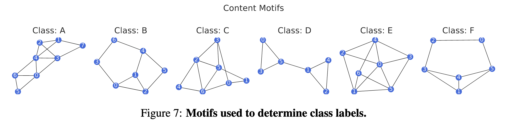
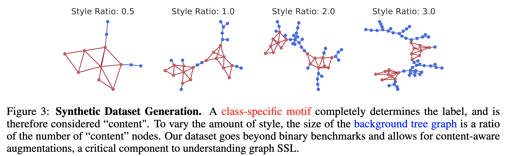

We provide a set of sample motifs in `motif_dict.py/MOTIFDICT`. However, new motifs can be easily added by adding the corresponding edge list (value) and dataset name (key) to `MOTIFDICT.` Please insure that any newly added motifs are not isomorphic to the others to ensure classification is possible. When creating the dataset, we label edges and nodes according to whether they belong in the motif or the selected background graph. This allows us to use the corresponding node/edge information to perform oracle augmentations. Please see ``edge_removing_caa.py`` for an example.

To generate an example 6-class dataset, across several style ratios, run `./create_dataset.sh`. Below are examples of different content motifs.

In the provided scripts, `multiplier` controls the style-vs-content ratio, i.e. how many nodes belong to the background graph vs. how many belong to the content motif. Below, are examples of varying style ratios. 
