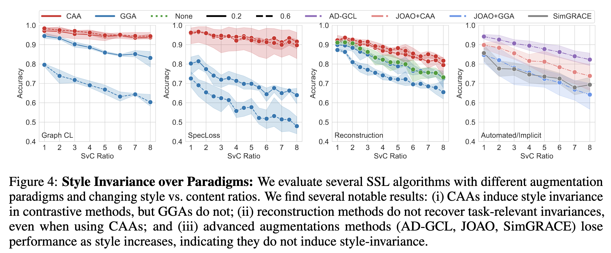

## Evaluating Graph SSL for Style Invariance   

Please use the provided scripts to train models using different graph SSL methods (`run_method.sh`), evaluate at different style-vs-content ratios (`run_svc.sh`) and compute invariance and separability scores (`run_compute_invariance_sep.sh`).  

